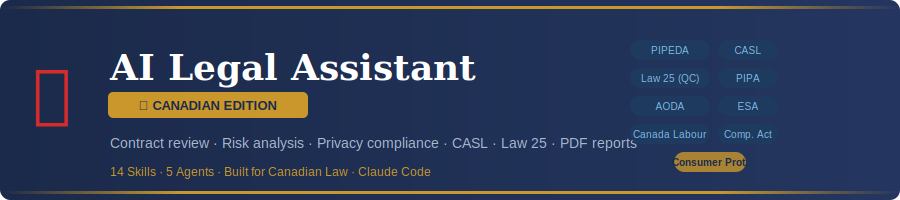

**AI-powered contract review and legal document generation — built for Canadian law.**  
Review contracts, flag risks, generate NDAs, audit PIPEDA/CASL/Law 25 compliance, check employment standards, and produce client-ready PDF reports — all from Claude Code.

Every Canadian contract has hidden risks. This tool finds them in 60 seconds.

---

## 🍁 Why a Canadian Edition?

Canadian law is fundamentally different from US law in ways that matter for every contract:

| Issue | US Law | Canadian Law |
|-------|--------|--------------|
| Privacy | CCPA / GDPR (US adaptation) | PIPEDA · Law 25 (QC) · BC/AB PIPA |
| Email marketing | CAN-SPAM (opt-out) | **CASL (opt-in required)** — fines up to CAD $10M |
| Employment contracts | At-will employment (most states) | **Common law reasonable notice** — can be months/years |
| Non-competes | Widely enforced | **Strict reasonableness test** — rarely >12 months |
| Quebec | Common law | **Civil Code of Quebec** — completely different framework |
| Privacy fines | Up to USD $7,500/consumer (CCPA) | Up to CAD **$25M or 4% of global revenue** (Law 25) |
| Trade secrets | Federal DTSA statute | **Contract and common law only** |
| Work for hire | Broad US Copyright Act doctrine | **Narrower** — must be explicitly assigned in Canada |

A US-trained legal AI tool can miss all of these. This tool is built from the ground up for Canada.

---

## 📊 Why This Matters

| Metric | Value |
|--------|-------|
| Average Canadian lawyer rate | CAD $300–$600/hour |
| Basic contract review (law firm) | CAD $1,500–$5,000 |
| CASL fine per violation | Up to CAD $10,000,000 |
| Law 25 (Quebec) fine | Up to CAD $25,000,000 or 4% global revenue |
| ESA wrongful dismissal cost | 12–24 months' salary |
| SMEs without formal legal review | 67% |
| Time to review with this tool | Under 60 seconds |

---

## ⚡ Quick Start

```bash
curl -fsSL https://raw.githubusercontent.com/YOUR-USERNAME/ai-legal-canada/main/install.sh | bash
```

One command installs all 14 skills, 5 agents, and the PDF generation script.

---

## 🍁 All 14 Commands

### Contract Analysis

| Command | What It Does |
|---------|--------------|
| `/legal review <file>` | **Flagship** — Full contract review with 5 parallel agents. Returns a Contract Safety Score, clause-by-clause analysis with Canadian law references, and prioritized recommendations in CAD. |
| `/legal risks <file>` | Deep risk analysis with CAD financial exposure for every clause. Flags PIPEDA, CASL, ESA, and Competition Act violations. |
| `/legal compare <file1> <file2>` | Side-by-side comparison of two versions. Flags changes that affect your Canadian law position. |
| `/legal plain <file>` | Translates every clause into plain English (or French for Quebec contracts). |
| `/legal negotiate <file>` | Generates counter-proposals with replacement language, citing *Bhasin v. Hrynew* (good faith), *Shafron v. KRG* (non-competes), and provincial ESA floors. |
| `/legal missing <file>` | Finds protections that SHOULD be in the contract under Canadian law — PIPEDA clauses, ESA-compliant termination, force majeure. |

### Document Generation

| Command | What It Does |
|---------|--------------|
| `/legal nda <description>` | Generates a custom NDA — mutual, one-way, employee, vendor. Quebec option: Civil Code of Quebec + French version. |
| `/legal terms <url>` | Generates Terms of Service — CASL compliant, provincial Consumer Protection Act compliant, Quebec-aware. |
| `/legal privacy <url>` | Generates a privacy policy compliant with PIPEDA, Law 25 (Quebec), BC PIPA, and AB PIPA. Flags cross-border transfer obligations. |
| `/legal agreement <type>` | Generates Canadian business agreements — freelancer contracts (with CRA worker classification warning), partnerships, SOWs, MSAs, shareholders agreements under CBCA/provincial BCAs. |
| `/legal freelancer <file>` | Specialized review for contractors. Flags CRA employee vs. contractor classification risk, IP assignment under the Copyright Act, and non-compete enforceability. |

### Compliance & Reporting

| Command | What It Does |
|---------|--------------|
| `/legal compliance <url>` | Canadian compliance gap analysis — PIPEDA, CASL, Law 25, AODA (Ontario), WCAG 2.0, Competition Act, provincial Consumer Protection Acts. |
| `/legal casl <description>` | 🆕 **Canada-only** CASL-specific email and electronic marketing compliance checker. Audits consent basis, message content, unsubscribe mechanics, and implied vs. express consent tracking. |
| `/legal report-pdf` | Professional PDF report with score gauges, risk charts, and prioritized actions — formatted for Canadian business use (CAD amounts, Canadian statute citations). |

---

## 🏆 The Flagship: `/legal review`

Run it on any contract and get:

1. **Contract Safety Score** (0–100) with letter grade
2. **Risk Dashboard** — high/medium/low risk clause counts (CAD exposure)
3. **Clause-by-Clause Analysis** — every clause scored, explained, with Canadian law citation
4. **Canadian Compliance Flags** — PIPEDA, CASL, Law 25, ESA, Competition Act
5. **Missing Protections** — what Canadian law requires that's absent
6. **Obligations Timeline** — every deadline mapped (with statutory notice period comparison)
7. **Negotiation Priorities** — ranked by CAD financial exposure
8. **Next Steps** — actionable checklist

### How It Works

```
/legal review vendor-contract.pdf
```

5 AI agents launch in parallel:

| Agent | Role | Weight |
|-------|------|--------|
| Clause Analyst | Identifies every clause; flags Quebec/ESA/statutory issues | 20% |
| Risk Assessor | Scores each clause; estimates CAD exposure | 25% |
| Compliance Checker | PIPEDA · CASL · Law 25 · ESA · Competition Act | 20% |
| Terms Mapper | Maps obligations, deadlines, ESA notice period comparisons | 15% |
| Recommendations Engine | Counter-proposals with Canadian law citations | 20% |

Results are aggregated into a unified report with a single Contract Safety Score.

---

## 🆕 CASL Checker — Canada-Unique Feature

`/legal casl` is unique to this Canadian edition. CASL is one of the strictest email marketing laws in the world — stricter than CAN-SPAM in every dimension. No US-built legal tool covers it properly.

```
/legal casl my marketing email campaign
/legal casl our weekly newsletter system
/legal casl re-permission campaign for 50,000 contacts
```

CASL fines: up to **CAD $10,000,000** per violation. The CRTC has levied multi-million dollar fines against major Canadian companies.

---

## 🔒 Privacy Compliance — PIPEDA vs. Law 25

This tool handles both federal PIPEDA and Quebec's Law 25 (the strictest privacy law in Canada):

| Feature | PIPEDA (Federal) | Law 25 (Quebec) |
|---------|-----------------|-----------------|
| Privacy Officer | Required | Required |
| Breach notification | As soon as feasible | **72 hours** to CAI |
| Right to portability | Pending (Bill C-27) | **Required now** |
| Right to erasure | Pending | **Required now** |
| Cookie consent | Best practice | **Mandatory** |
| Cross-border transfers | Contractual protection | **PIA required** |
| Max fine | CAD $100,000 | **CAD $25M or 4% global revenue** |

```
/legal privacy https://mycompany.ca
/legal compliance https://myquebecstore.ca
```

---

## 👷 Freelancer & Employment Focus

Canada's employment law is dramatically different from US at-will employment. This tool flags:

- **Common law reasonable notice** — courts can award 12–24 months' salary beyond ESA minimums
- **CRA misclassification** — contractor classified as employee = back CPP/EI + penalties
- **Copyright Act** — you own your work in Canada unless explicitly assigned
- **Non-compete enforceability** — Canadian courts rarely enforce non-competes > 12 months
- **ESA minimums** — any contract below ESA floors is void to that extent

---

## 📋 Project Structure

```
ai-legal-canada/
├── legal/
│   └── SKILL.md                    # Canadian law orchestrator (command router)
├── skills/
│   ├── legal-review/SKILL.md       # Full contract review (5 agents, Canadian law)
│   ├── legal-risks/SKILL.md        # Risk analysis with CAD exposure
│   ├── legal-compare/SKILL.md      # Contract comparison
│   ├── legal-plain/SKILL.md        # Plain English / French translation
│   ├── legal-negotiate/SKILL.md    # Counter-proposals (Bhasin, Shafron, ESA)
│   ├── legal-missing/SKILL.md      # Missing Canadian-law protections
│   ├── legal-nda/SKILL.md          # NDA — common law + Quebec civil law
│   ├── legal-terms/SKILL.md        # Terms of service — CASL + CPA compliant
│   ├── legal-privacy/SKILL.md      # Privacy policy — PIPEDA / Law 25 / PIPA
│   ├── legal-agreement/SKILL.md    # Business agreements — CBCA / provincial
│   ├── legal-compliance/SKILL.md   # Compliance — PIPEDA · CASL · AODA · Law 25
│   ├── legal-freelancer/SKILL.md   # Contractor review — CRA classification
│   ├── legal-casl/SKILL.md         # 🆕 CASL email compliance checker
│   └── legal-report-pdf/SKILL.md   # PDF report generator
├── agents/
│   ├── legal-clauses.md            # Clause analyst (Canadian law aware)
│   ├── legal-risks.md              # Risk assessor (CAD exposure model)
│   ├── legal-compliance.md         # PIPEDA · CASL · Law 25 · ESA checker
│   ├── legal-terms.md              # Obligations mapper (ESA notice comparison)
│   └── legal-recommendations.md    # Counter-proposal engine (Canadian precedents)
├── scripts/
│   └── generate_legal_pdf.py       # PDF generator (CAD, Canadian law branding)
├── templates/
│   └── contract-review-template.md # Report template (Canadian statutes)
├── assets/
│   └── banner.svg                  # Canadian edition banner
├── install.sh                      # One-line installer
├── uninstall.sh                    # Clean uninstaller
└── README.md
```

---

## ⚙️ Requirements

- **Claude Code** (with an active Anthropic API key)
- **Python 3.8+** (for PDF generation only)
- **reportlab** — `pip3 install reportlab` (for PDF generation only)

---

## 🔧 Uninstall

```bash
curl -fsSL https://raw.githubusercontent.com/YOUR-USERNAME/ai-legal-canada/main/uninstall.sh | bash
```

Or run locally:

```bash
./uninstall.sh
```

---

## 🏛️ Canadian Legal Frameworks Covered

| Framework | Full Name | Scope |
|-----------|-----------|-------|
| PIPEDA | Personal Information Protection and Electronic Documents Act, S.C. 2000, c. 5 | Federal privacy |
| Bill C-27 / CPPA | Consumer Privacy Protection Act (pending) | Federal privacy (next gen) |
| Law 25 | Act respecting the protection of personal information in the private sector | Quebec privacy |
| BC PIPA | Personal Information Protection Act, S.B.C. 2003, c. 63 | BC privacy |
| AB PIPA | Personal Information Protection Act, S.A. 2003, c. P-6.5 | Alberta privacy |
| CASL | Canada's Anti-Spam Legislation, S.C. 2010, c. 23 | Electronic messages |
| Canada Labour Code | R.S.C. 1985, c. L-2 | Federal employment |
| Provincial ESAs | Employment Standards Acts (BC, ON, AB, QC, etc.) | Provincial employment |
| CBCA | Canada Business Corporations Act, R.S.C. 1985, c. C-44 | Federal corporations |
| Competition Act | R.S.C. 1985, c. C-34 | Antitrust / marketing |
| Copyright Act | R.S.C. 1985, c. C-42 | Intellectual property |
| Consumer Protection Acts | Various provincial | B2C contracts |
| AODA | Accessibility for Ontarians with Disabilities Act, S.O. 2005, c. 11 | ON accessibility |
| Civil Code of Quebec | CQLR c CCQ-1991 | Quebec contract law |
| Charter of the French Language | CQLR c C-11 (Bill 96) | Quebec language rights |

---

## 💼 Use Cases

### For Canadian Freelancers & Agencies
- Review client contracts before signing — catch common non-compete and IP traps
- Generate NDAs for new client engagements (common law or Quebec civil law)
- Understand your CRA classification risk before signing "contractor" agreements
- Offer contract review as a paid service (CAD $500–$2,000 per review)

### For Canadian SMEs
- Review vendor, supplier, and customer contracts
- Generate PIPEDA/Law 25-compliant privacy policies and CASL-compliant terms of service
- Run compliance audits on your website before a Law 25 or CASL investigation
- Understand employment contract obligations before hiring

### For Canadian Consultants & Advisors
- Add Canadian legal document review to your service offering
- Generate professional PDF reports for clients
- Offer compliance audits as a recurring service
- Serve clients in both English and French Canada

---

## ⚠️ Disclaimer

This tool is for educational and informational purposes only. It does **not** provide legal advice and should **not** be used as a substitute for consultation with a licensed Canadian lawyer (barrister/solicitor). Always have a qualified lawyer review any contract before signing.

To find a licensed lawyer in your province:
- **BC**: Law Society of BC — [lawsociety.bc.ca](https://www.lawsociety.bc.ca)
- **Ontario**: Law Society of Ontario — [lso.ca](https://www.lso.ca)
- **Alberta**: Law Society of Alberta — [lawsociety.ab.ca](https://www.lawsociety.ab.ca)
- **Quebec**: Barreau du Québec — [barreau.qc.ca](https://www.barreau.qc.ca)
- **National**: Canadian Bar Association — [cba.org](https://www.cba.org)

---

## 🙏 Credits

Forked and heavily adapted from [zubair-trabzada/ai-legal-claude](https://github.com/zubair-trabzada/ai-legal-claude).  
Canadian law content, CASL skill, Quebec Law 25 provisions, employment law framework, and all provincial adaptations are original additions.

---

**Part of the Claude Code Skills Series — Canadian Edition**

*All monetary amounts in CAD · Analysis based on Canadian federal and provincial law · Not legal advice*
